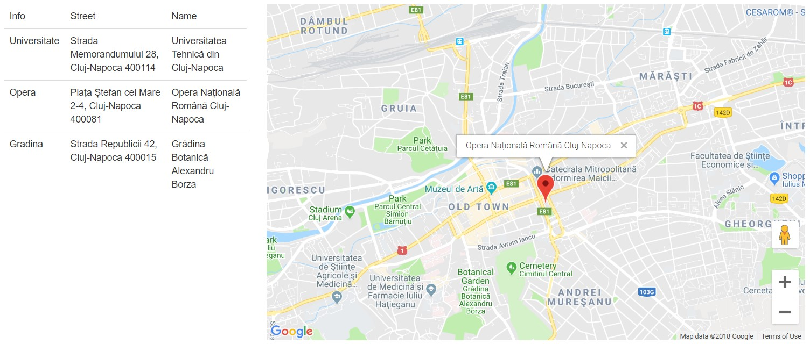

# ANGULAR-MAP-MONGO

[](https://github.com/artiomleo/ANGULAR-MAP-MONGO/tree/master/Angular5MAP-MONGO/models)

## Quick Start
Install [MongoDB](https://www.mongodb.com/download-center/v2/cloud)

Run ``` npm install```

Run server ```node server.js```

 Run ```ng serve``` for a dev server. Navigate to http://localhost:4200/. The app will automatically reload if you change any of the source files.
 
 # Edit component
 [](https://github.com/artiomleo/ANGULAR-MAP-MONGO/tree/master/Angular5MAP-MONGO/models)
